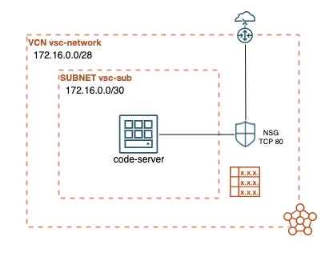

# Code-Server on Oracle Cloud Infrastructure 

 

## Deploy Code-Server on a compute instance running on Oracle Cloud Infrastructure 

One-click button deploy to deploy [code-server](https://github.com/cdr/code-server) on Oracle Cloud Infrastructure compute instance.

## Introduction
This project enables you to create and configure network and compute resources on OCI and launch a code-server instance.

## Architecture Diagram

### Prerequisites
- Oracle Cloud account

## Getting Started

1. Click the button below to begin the deploy of code-server:
    
    

2. If needed, log into your account. You should then be presented with the **Create Stack** page. 
    
    These next few steps will deploy a stack to your OCI tenancy. This will include a virtual clod network and a compute instance and the necessary configurations to deploy and run code-server from within your OCI account.

    Under *Stack Information* (the first screen), check the box *I have reviewed and accept the Oracle Terms of Use*. Once that box is checked, the information for the stack will be populated automatically.
    
3. Click **Next** at the bottom of the screen. This will take you to the **Configure Variables** page. On this page you can optionally provide/change these variables: 
    - **Compartment** (_optional_): select the compartment where do you want to deploy the stack
    - **SSH public key** (_optional_): the key will allow you to login into the instance. 
    - **Instance Name** (_optional_): Name of the instance [_default: oci-code-server_]
    - **Shape** (_optional_): Instance shape [_default: VM.Standard.E4.Flex_]. If you want your Compute instance to function after your Free Trial ends, check the box for an Always Free Shape. 
    - **OCPUs number** (_optional_): Only if you have selected a Flex shape [_default: 1_]
        
    Then click **Next** again.

4. On the **Review** page, be sure *Run Apply* is checked, and click **Create**.

5. This will take you to the **Job Details** page, and OCI will begin creating the stack and deploying the custom image for the lab. This will take a few minutes. When it completes (assuming everything went smoothly), the **Job Details** will show a bright green square with "Succeeded" below it.

6. Go back to the **Stack Details** page, in the **Application Information** tab you can find the public IP of the instance. You can use that IP for the first login to VS Code.
    

## URLs
For more information about `code-server`: 
* [code-server](https://github.com/coder/code-server)
* [deploy-code-server](https://github.com/coder/deploy-code-server)

## Contributing
This project is open source.  Please submit your contributions by forking this repository and submitting a pull request!  Oracle appreciates any contributions that are made by the open source community.

## License
Copyright (c) 2021 Oracle and/or its affiliates.

Licensed under the Universal Permissive License (UPL), Version 1.0.

See [LICENSE](LICENSE) for more details.

---

